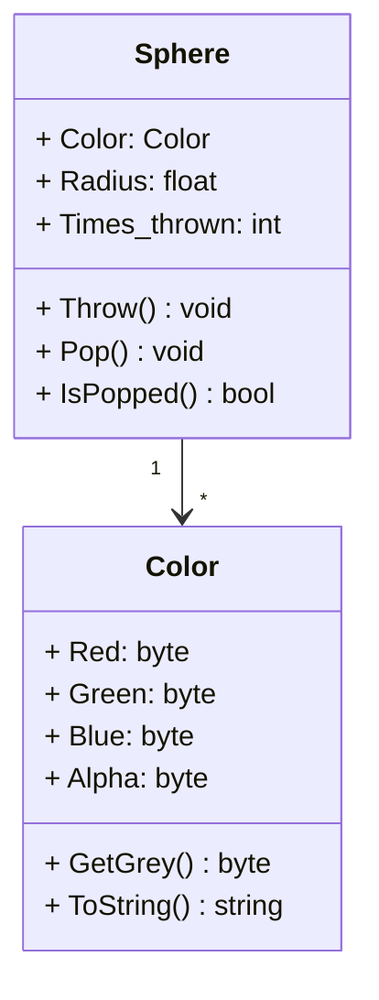

```mermaid
classDiagram
    class Color{
        + Red: byte
        + Green: byte
        + Blue: byte
        + Alpha: byte
        
        + GetGrey() byte
        + ToString() string
    }


    class Sphere{
        + Color: Color
        + Radius: float
        + Times_thrown: int

        + Throw() void
        + Pop() void
        + IsPopped() bool
    }

    Sphere "1" --> "*" Color
```